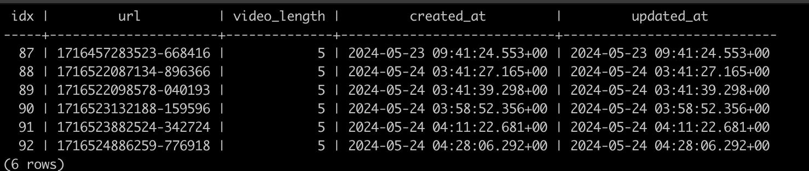

 # HLS 스트리밍 예제  <!-- 제목 정의 -->

<!-- 부제목 정의 -->
## NodeJS(Typescript)환경에서 동영상 스트리밍
- 스트리밍 데이터를 m3u8의 확장자를 가진 재생목록 파일과 잘게 쪼갠 다수의 ts파일을 http을 통해 전송하는 방식.
  
<!-- 시연영상 정의 -->

<!-- 기술 스택 정의 -->
## 기술 스택
### BE
- Typescript, Express, PostgreSQL, Prisma

### FE
- HTML5, VideoJS, Vanila Javascript

<!-- 리소스 정의, (스펙, db record 등) -->
### 리소스

